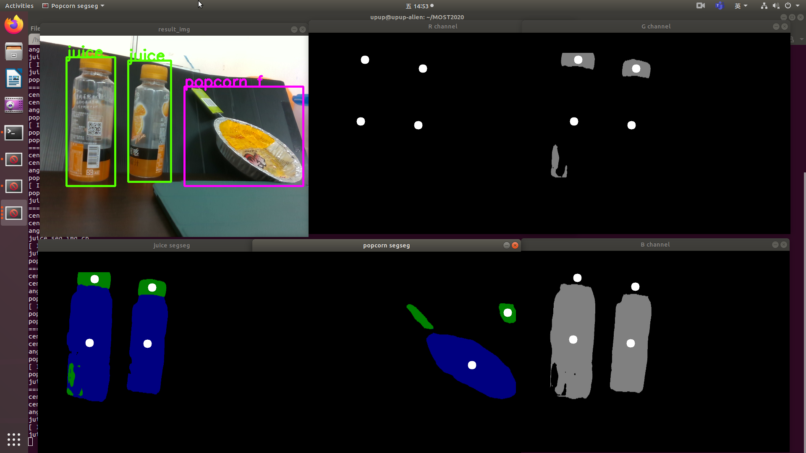
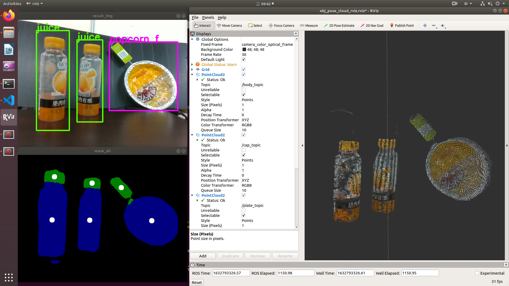
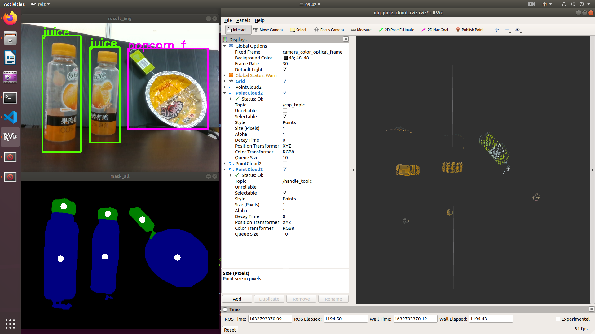

```
#參考affordance_ros內REAMDME.md 開啟YOLOv4, DeepLabV3+
. devel/setup.bash
roslaunch part_detection part_detection.launch
rosrun part_sematic_seg juice_seg.py
rosrun part_sematic_seg popcorn_seg.py
rosrun part_sematic_seg show_seg_all.py

. devel/setup.bash
roslaunch obj_pose_cloud obj_pose_cloud.launch
```

## Dependencies
* Install [realsense-ros](https://github.com/IntelRealSense/realsense-ros)
* Install [cv_bridge for Python3]()

## Software environment
* Ubuntu 18.04
* ROS Melodic
* Python 3.6.9
* opencv 4.5.1 cv2 (?)
* cv_bridge (python3 待測試) (?)
* Install pcl (?)
* Install cv_bridge(?)

### 部件點雲
+ Object detection (YOLOv4) + Sematic segmentation (DeepLab V3+)
 
+ Extracted point cloud from masks
 
+ Body, plate point cloud
 
+ Cap, handle point cloud


- [ ] separate different caps into different point clouds